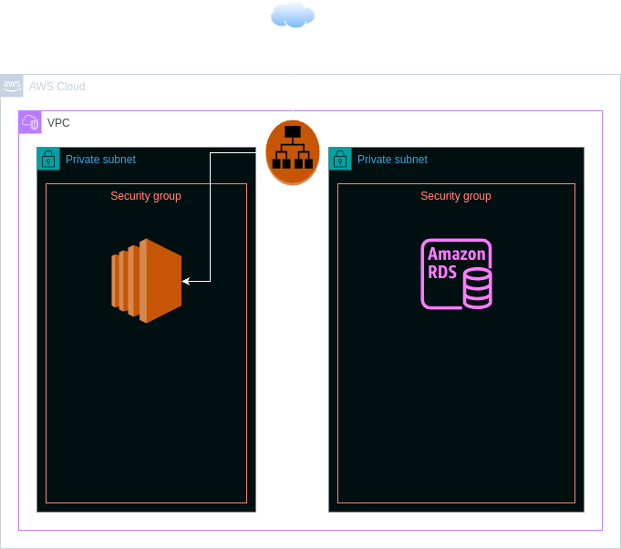

# Document d'Architecture Technique

## 1. Introduction

### 1.1 Objectif
Ce document décrit l'architecture technique mise en œuvre pour déployer une infrastructure AWS utilisant Terraform, afin de supporter une application web avec WordPress et une base de données MariaDB.

## 2. Architecture Générale

### 2.1 Vue d'ensemble
L'architecture repose sur les principaux services AWS suivants :
- **VPC (Virtual Private Cloud)** : Pour isoler l'environnement réseau.
- **Subnets** : Deux sous-réseaux publics pour les instances EC2 et une base de données.
- **ALB (Application Load Balancer)** : Pour la répartition de charge du trafic HTTP vers les instances EC2.
- **EC2 (Elastic Compute Cloud)** : Instance utilisée pour héberger WordPress.
- **RDS (Relational Database Service)** : Instance MariaDB pour la base de données de WordPress.
- **Security Groups** : Pour contrôler le trafic entrant et sortant des instances.

### 2.2 Diagramme d'architecture

## 3. Composants de l'infrastructure

### 3.1 AWS VPC
- **CIDR Block** : 10.0.0.0/16
- **Subnets** : Deux sous-réseaux publics dans les zones de disponibilité `eu-west-1a` et `eu-west-1b`.

### 3.2 Instances EC2 (WordPress)
- **Type d'instance** : t3a.small
- **Sous-réseau** : 10.0.1.0/24
- **UserData** : Script de configuration pour installer WordPress.

### 3.3 RDS MariaDB
- **Engine** : MariaDB
- **Classe d'instance** : db.t3.micro
- **Sous-réseaux** : 10.0.1.0/24 et 10.0.2.0/24
- **Security Group** : Contrôlé par `db_sg` pour limiter l'accès aux instances EC2.

### 3.4 ALB (Application Load Balancer)
- **Listener** : HTTP sur le port 80
- **Target Group** : Pour rediriger le trafic vers les instances EC2 WordPress.

### 3.5 Security Groups
- **web_sg** : Pour les instances EC2 (ports 80, 443, 22 ouverts)
- **db_sg** : Pour l'instance RDS (port 3306 ouvert uniquement depuis `web_sg`)

## 4. Sécurité

### 4.1 Contrôles de sécurité
- Restriction d'accès aux ports par Security Groups.
- Gestion des clés SSH pour l'accès aux instances EC2.
- Utilisation de UserData sécurisé pour le déploiement d'instances EC2.

### 4.2 Mesures de protection
- Mise en œuvre de mises à jour régulières.
- Surveillance des journaux et des alertes de sécurité.
- Sécurisation des données sensibles dans la configuration et le stockage.
